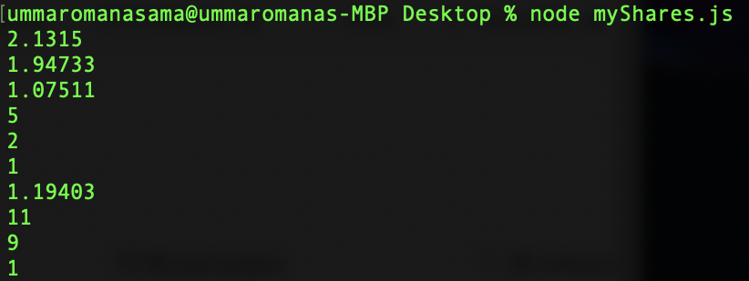

# SoFi

Summary: SoFi is currently unable to give me a CSV file with my SoFi Invest account information. With the data, I hope to create a spreadsheet managing my information and tracking my investments. I decided to do my best of extracting the visible data from their website by copy/pasting and making it tangible with few functions here and there and not manually typing in the data.

* mySymbols - Extracts the ticker symbols of investments from the data.

* myShares - Extracts the shares of investments from the data.

